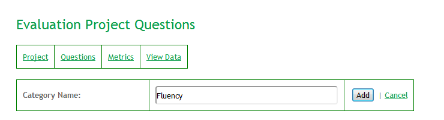
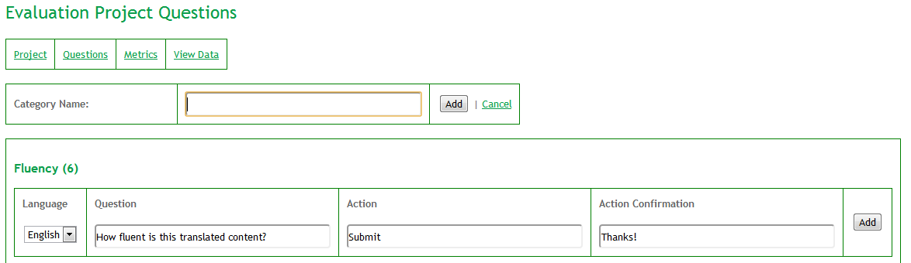
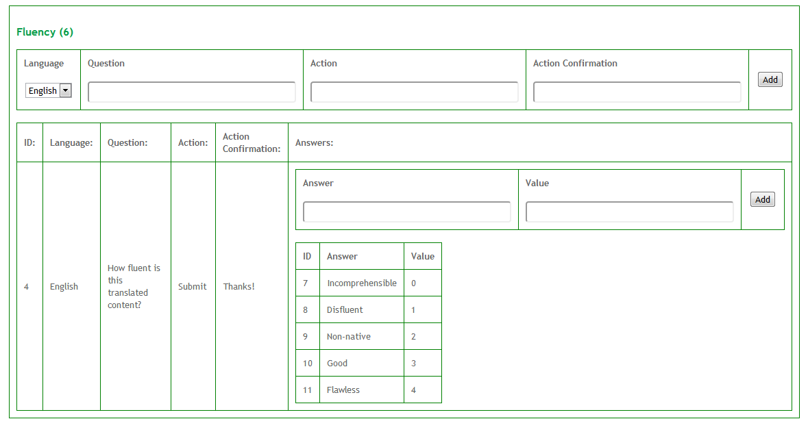

.. _evaluationProjectManagement:

Evaluation Project Management
=============================

Managing evaluation projects
----------------------------

On the :guilabel:`Evaluation Projects` page, a logged-in user can see all of the projects they have created. To create a new project, a user may click on :guilabel:`Create New Project`. To view the details of a project, a user may click :guilabel:`View` on the right column of the project record.

Creating an evaluation project
------------------------------

To create a project, the *Name*, *Description* and *Organisation* fields must be filled in:

  * *Name*: Project Name (Does not have to be unique)
  * *Description*: Short Project Description
  * *Organisation*: Name of the organisation that owns the project (e.g. “Symantec”).
  * *API Key Domain*: Specify the domain name or IP address the API access will be restricted to (e.g. www.accept-portal.com). Multiple values separated with a semi-colon are possible.

Once :guilabel:`Create` is clicked, the user is redirected to the :guilabel:`Evaluation Projects` page, where the newly-created project is listed. When a project is created, an API Key is automatically generated and associated with the project. If details must subsequently be changed (e.g. project name or description), it is possible to change them by clicking on :guilabel:`Edit`.

Editing an evaluation project
-----------------------------

The project page shows information about the current project, including the project's ID. Some of this information can be edited by clicking the :guilabel:`Edit` button.

Adding evaluation project questions
-----------------------------------

Once a project has been created, the first step is to define a question category, which is used as a container for one or more questions (as defined in the :ref:`evaluationDefinitions` section). Once a category has been defined, a first question can be added, as shown below.

In this example, a *Fluency* question category has been defined as a container for one or more questions. It is then possible to add a question to this category as shown below:

A question has multiple attributes besides the question text itself (which happens to be *How fluent is this translated content?* in this example):
  * A *language* (e.g. English if the Question text is in English)
  * An *Action* text (which may be used to instruct users how to submit an answer)
  * An *Action confirmation* text (which may be used to show users that their answer has been submitted).

Once the question attributes have been added, the question’s answers (both text and value) may be added, as shown below:

In the example above, each answer has two parts: the actual answer text to present to the user and a value. The value field, which is optional, allows project creators to give information on how these answers may be presented to the user. For example, in the example above a ranking scheme from *incomprehensible* to *flawless* has been used. In order to make sure that answers are presented in a natural order on the client-side, the values may be used to sort and order the answers (from *0* to *4*).

Once at least one question and one answer have been defined for a given project, answers may be collected using the :ref:`evaluationAPI`.

.. note:: Answers that require free-form text from the user may be submitted using additional parameters. More information is provided in the following section: :ref:`scoreMethod`.

Adding evaluation project content
---------------------------------

Instead of relying on a client-side mechanism to make content available for evaluation, content may be added to an evaluation project. To do so, a JSON file may be uploaded by clicking the :guilabel:`Add Content` link and selecting a file. The file must comply with the following format:

.. literalinclude:: evaluation_chunks.json
   :language: javascript
   :emphasize-lines: 5-6

As shown in the example above, any number of sentences (or text chunks) may be uploaded in **chunkList** array. Each **chunk**, which will be used during the actual evaluation task, must be a UTF-8 string. Additional metadata may be included in **chunkInfo**. The **active** value may be set to 1 (active) or 0 (not active) depending on whether this specific chunk should be considered on the client side.

Viewing evaluation project metrics and data
-------------------------------------------

Answers that are submitted on the client-side are recorded in the ACCEPT Evaluation database. A summary of these answers is provided on the :guilabel:`Metrics` Page. The full set of evaluation project data may be found on the :guilabel:`View Data` page.

