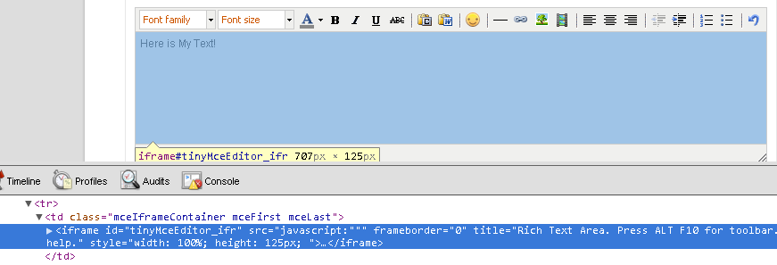
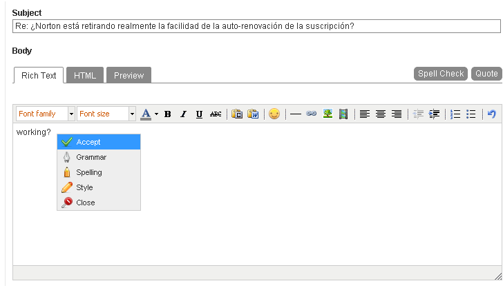
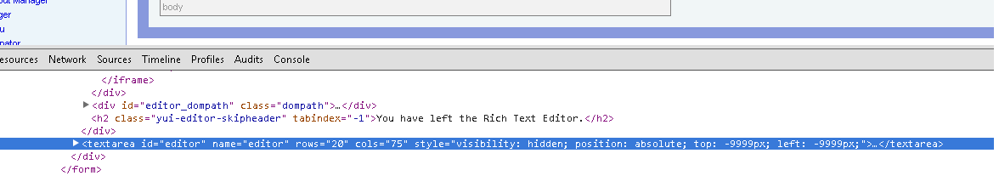
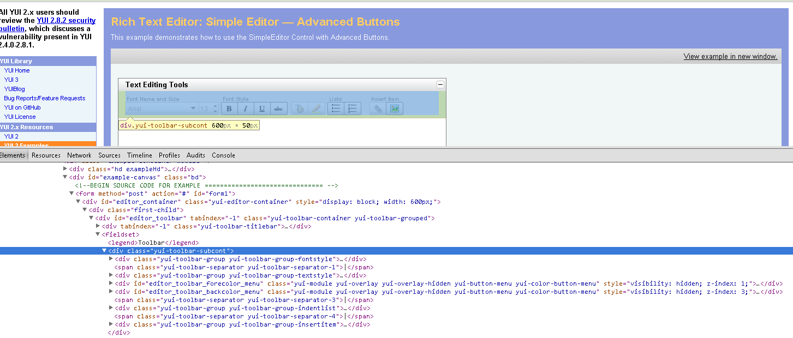
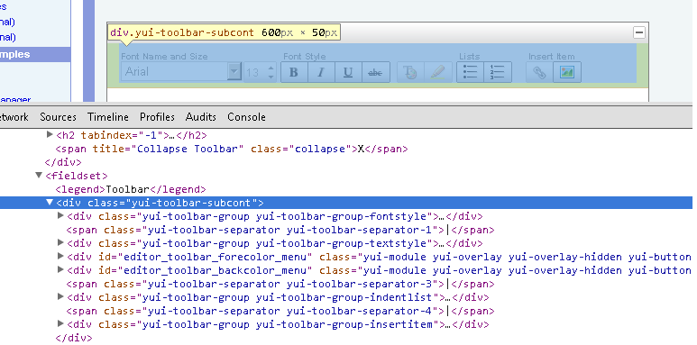
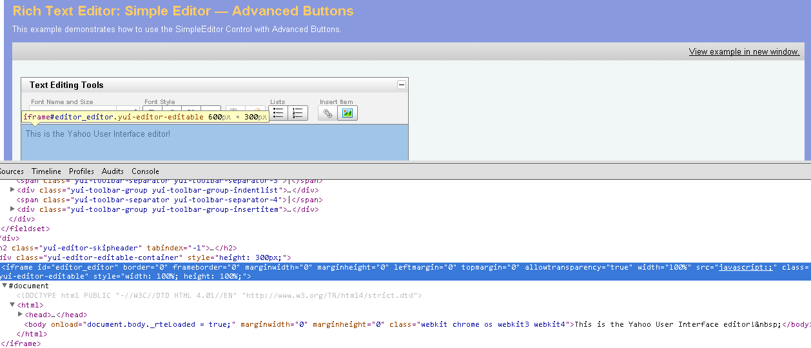
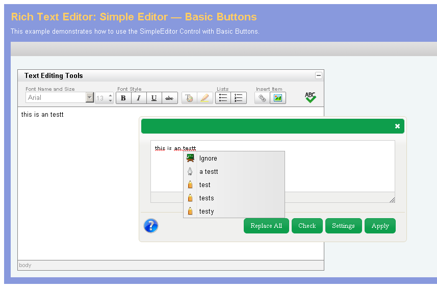

Examples
========

For a better understanding on how the plug-in code can be added to your web application we are going to walk through four examples.

.. note:: You can find the full code for these examples within the download package in the :file:`examples` folder.

Example 1 (Right Click Context Menu)
------------------------------------

You own a Web site that has a forum where users can drop questions and you want improve the text quality of your users input. For this case you decide that you don’t want to compromise your current site UI with fancy text editors and you decide to use the ACCEPT plug-in by attaching it to the very basic text area you already have in place.

This way when a user right clicks over your text area it will trigger the options available for checking the text just like is showed in the :doc:`installation` section. Below is the full explanation for the code you can find within the :file:`examples` folder:

JavaScript Code
^^^^^^^^^^^^^^^

Before injecting jQuery or JavaScript actions over your DOM, you should wait for the DOM to be completely loaded. Using jQuery this can be achieved using the following syntax:

.. code-block:: javascript

    $(document).ready(function ()
    {
        //Your code here
    });

Now add the accept plug-in code:

.. code-block:: javascript

    $(document).ready(function () {
    $("#myTextArea").Accept({
            configurationType: 'contextMenu',
            righClickEnable:true,
            AcceptServerPath: "http://www.accept-portal.eu/AcceptApi/Api/v1",
            ApiKey:"ENTER_KEY_HERE",
            Lang: "en",
            imagesPath: "../css/images",
            requestFormat: "HTML",
            styleSheetPath: '../css/'
    });
    });

HTML Code
^^^^^^^^^

The HTML code for this example is really simple, all you need is to have an identified text area so that all the plug-in logic be integrated.

.. code-block:: html

    <textarea id="myTextArea" rows="10" cols="40" >
    this is an test
    <textarea>

That’s it. You now have the ACCEPT Plug-in working on your site. Here is the full code snippet:

.. code-block:: html

    
    
    <link href="http://www.accept-portal.eu/Plugin/v2.0/css/Accept.css" rel="stylesheet" type="text/css" />
    <link href="http://www.accept-portal.eu/Plugin/v2.0/css/jquery-ui.css" rel="stylesheet" type="text/css" />
    
    
    

Example 2 (TinyMCE Embedded)
----------------------------

Let’s take the same situation as Example 1 but this time you are using the Tiny MCE embedded editor.

JavaScript Code
^^^^^^^^^^^^^^^

The JavaScript code is very similar to the one in Example 1, the only value that changes is the value for the parameter :makevar:`configurationType` - from “contextMenu” to “tinyMceEmbedded” and the addition of a extra parameter containing the location of your Tiny MCE .JS file. Here’s the code:

 .. code-block:: javascript

    $(document).ready(function ()
    {
        $("#myTextArea").Accept({
           configurationType: 'tinyMceEmbedded',
            AcceptServerPath: "http://www.accept-portal.eu/AcceptApi/Api/v1",
            ApiKey:"ENTER_KEY_HERE",
            Lang: "en",
            imagesPath: "../css/images",
            tinyMceUrl: "../extras/tiny_mce/tiny_mce.js",
            styleSheetPath: '../css/',
            requestFormat: "HTML"
        });
    });

HTML Code
^^^^^^^^^

The HTML code is exactly the same as Example 1, once again just an identified text area is needed:

.. code-block:: html

    <textarea id="myTextArea" rows="10" cols="40" >
    this is an test
    <textarea>

Example 3 (A more difficult integration)
----------------------------------------

Sometimes it can be a bit more difficult to integrate the plug-in with an existing embedded text editor. One approach is to integrate the ACCEPT plug-in by injecting a right click event over the existing text editor. To do this a bit more work its needed. Notice that in both Example 1 and 2 we used a simple text area element as a place holder for our plug-in, but in this case there is a text editor already embedded within the text area.

What do we do? Well no big deal, lets follow a few steps.

STEP 1
^^^^^^

.. code-block:: html

    <textarea class="lia-form-tiny-mce-editor-input" id="tinyMceEditor" name="tinyMceEditor"></textarea>
    <iframe id="tinyMceEditor_ifr" src='javascript:""' frameborder="0" title="Rich Text Area. Press ALT F10 for toolbar. Press ALT 0 for help." style="width: 100%; height: 206px; ">
    <html><head xmlns="http://www.w3.org/1999/xhtml"><meta http-equiv="X-UA-Compatible" content="IE=7">
    <meta http-equiv="Content-Type" content="text/html; charset=UTF-8">
    <link type="text/css" rel="stylesheet" href="http://website1/html/js/lib/tinymce/3.4.1/themes/advanced/skins/default/content.css">
    <link type="text/css" rel="stylesheet" href="http:// website1/skins/358241/5F4439F43AFCD2AFDF49DA5622800B40/example734965398.css">
    </head>
    <body id="tinymce" class="mceContentBody lia-message-editor" spellcheck="false" dir="ltr">
    
eewrwerwer

    </body>
    </html>
    </iframe>

Looking at the code we can see by the name and identifier of the text area that the editor plug-in used is Tiny MCE (to be honest this doesn’t matter, it could just as easily be any other editor and the procedure would be the same), what really matters is for us to understand how we can integrate our ACCEPT plug-in into the existing code.

Looking carefully at the previous code snippet we can see that there is an IFRAME being used.

.. note:: Using a Web debug tool we can better understand where the text is being displayed:

Generally, all the rich web text editors behave the same way, they inject an IFRAME over the text source (in this case the text area identified in red as “tinyMceEditor”).

As the IFRAME is where a user will write, we need to inject our plug-in behaviour into the IFRAME instead of the text area as we did before.

STEP 2
^^^^^^

Now we need to include the ACCEPT plug-in files in the page header:

.. code-block:: html

    
    
    <link href="http://www.accept-portal.eu/Plugin/v2.0/css/Accept.css" rel="stylesheet" type="text/css" />
    <link href="http://www.accept-portal.eu/Plugin/v2.0/css/jquery-ui.css" rel="stylesheet" type="text/css" />
    
    

STEP 3
^^^^^^

Next the plug-in configuration with a few tweaks:

.. code-block:: html

    

Notice that in the last snippet we are still passing the text area ID as a DOM element for the plug-in:

.. code-block:: javascript

    $("#tinyMceEditor").Accept({ … })

but as the IFRAME is where the user text is kept and our plug-in doesn’t have a way to magically find it, we need to pass the information about the area where our context menu should be displayed, and we did that when we added the IFRAME ID as an extra parameter:

.. code-block:: javascript

    textEditorPlaceHolderId: "tinyMceEditor_ifr"

Now when refreshing our page we can see our right-click functionality being displayed.

Now everything should be working fine, but when clicking any of the checking options we get an “enter some text” message - this means that no text was passed to our plug-in.

Why is this happening?

The reason is related to the version and pre-configuration of the Tiny MCE plug-in.

For some reason the input text is not updating the text area element! Remember that we passed the text area ID to the ACCEPT plug-in expecting to get the text from it:

.. code-block:: html

    <textarea class="lia-form-tiny-mce-editor-input" id="tinyMceEditor" name="tinyMceEditor">NO TEXT HERE! :( </textarea>

So do we need to update the plug-in code according the text editor configuration? Fortunately no, the ACCEPT plug-in allows you to pass two extra parameters where you can write your own code to get and set the text content. We now need to add a custom text loader and text submitter.

.. _example3Step4:

STEP 4
^^^^^^

In order to customize the way your text is loaded and submitted back we need to pass two extra parameters (these are actually interpreted as functions):

.. code-block:: javascript

    LoadInputText: function ()
    {
        try
        {
            var inputText = tinymce.get('tinyMceEditor').getContent();
            return inputText;
        }
        catch (error) {
            return "";
        }
    }

The parameter :makevar:`LoadInputText` will pass the input text to be checked and in the case of the Tiny MCE text editor there is a built in method to get the text from the editor, so we can use that one:

.. code-block:: javascript

    var inputText = tinymce.get('tinyMceEditor').getContent();

Note that a try/catch block is needed because during the page load our plug-in will immediately run the “LoadInputText” method and we have no guarantees that “tinymce.get” method is already loaded.

Now we need a similar approach to send the text from our ACCEPT dialog back the editor:

.. code-block:: javascript

    SubmitInputText: function (text)
    {
        try
        {
           tinymce.get('tinyMceEditor').setContent(text);
        }
        catch (error) {    }

    }

The ACCEPT plug-in should now be working!!! Here is the full code snippet:

.. code-block:: html

    
    
    <link href="http://www.accept-portal.eu/Plugin/v2.0/css/Accept.css" rel="stylesheet" type="text/css" />
    <link href="http://www.accept-portal.eu/Plugin/v2.0/css/jquery-ui.css" rel="stylesheet" type="text/css" />
    
    
      

Example 4 (External Call Integration)
-------------------------------------

An external call integration allows us to use an existing HTML element in the Web page (or even inject a new HTML element) to trigger the plug-in dialog. This is best approach for situations where there is an existing embedded text editor in place and any minor change on the Web page style is **undesired**.

.. note:: For this use case we are using the simple `editor example <http://developer.yahoo.com/yui/examples/editor/simple_adv_editor.html>`_ from the Yahoo! UI 2 download package.
Let's suppose this HTML page is actually the environment where we want to integrate the ACCEPT |pre| plug-in.

STEP 1
^^^^^^

The first action to perform is always to identify what is the text source we want to target. In this example we want the same element used by the Yahoo editor.

.. note:: Using a Web debug tool we can better understand the Web page structure and find whatever we are looking for:

Now we know that the element with the *editor* ID is the text area where the Yahoo editor is being used and as such the one where
we want to implement the ACCEPT |pre| plug-in. The plug-in configuration starts with:

.. code-block:: javascript

    $('#editor').Accept({
    configurationType: 'externalCall',
    ...

Now we need to take a closer look at the Web page and try to understand from where (which HTML button, HTML image, etc) we could trigger the plug-in dialog:

Looking at the image we can easily conclude that ideally the ACCEPT |pre| dialog could be triggered from a button located in the editor toolbar. Since there are no available buttons we need to set up the ACCEPT |pre| plug-in to magically create a new HTML element for us.

STEP 2
^^^^^^

To add a new HTML element to the toolbar, we need first to identify what is the HTML element that contains all toolbar elements.

As shown above, the :samp:`div` element selected is actually the container for all elements in the editor toolbar. Therefore this :samp:`div` element works perfectly as a placeholder for the new element. Now that we know what the element is, we also need to find a way to identify it, but the :samp:`div` does not have any *id* attribute. Is this a problem? No it is not because the plug-in can use any valid jQuery selector to find the placeholder. In this case, we know that the CSS class attribute is unique for this element. We can use it to "teach" the ACCEPT |pre| plug-in how to find it:

.. code-block:: javascript

    $('#editor').Accept({
    configurationType: 'externalCall',
    injectSelector: '.yui-toolbar-subcont',
    ...

STEP 3
^^^^^^

At this stage we know the text area where to use the plug-in and the toolbar element where we want to add new HTML content, so now we need to decide what HTML content we want to add. For this example, we will inject a :samp:`div` element containing the ACCEPT :guilabel:`ABC` icon.

.. code-block:: html

    

    
    

This needs to be added under the :makevar:`injectContent` setting as part of the plug-in configuration:

.. code-block:: javascript

    $('#editor').Accept({
    configurationType:'externalCall',
    injectSelector:'.yui-toolbar-subcont',
    injectContent:'

',
    ...

STEP 4
^^^^^^

In this step, we need to identify the HTML element from where the click event that displays the ACCEPT dialog is triggered. In STEP 3, we injected code in the page with the aim of having an extra element to act as the element we are now looking for. Looking carefully at STEP 3 we can see that the *img* element is an ID property we made up for this purpose, so
this is the value we want to use for the :makevar:`triggerCheckSelector` setting, as shown below:

.. code-block:: javascript

    $('#editor').Accept({
    configurationType:'externalCall',
    injectSelector:'.yui-toolbar-subcont',
    injectContent:'

',
    triggerCheckSelector: '#triggerInjectedACCEPTbutton',
    ...

STEP 5
^^^^^^

The main steps are now completed, but in this case they are not sufficient. If we went ahead and tried to run this example with the current configuration, the plug-in would not work because the text content to check is not loaded into the dialog or properly submitted back to the source. This is due to the same reason explained in :ref:`example3Step4` of Example 3. Basically the Yahoo! UI editor does not keep the text content in the text area where it was installed but instead within an iframe built during the initialization. This is actually the most common behavior nowadays in WYSIWYG editors. Let's take a closer look:

What do we need to do in order to correct this issue? As part of the plug-in configuration, we need to provide custom methods to get the content into the dialog box and set it back to the source, in this case the iframe with an *editor_editor* ID. Here is the code:

.. code-block:: javascript

    $('#editor').Accept({
    configurationType:'externalCall',
    injectSelector:'.yui-toolbar-subcont',
    injectContent:'

',
    LoadInputText:function()
    {
        return $(document).contents().find('#editor_editor').contents().find('body').html();
    },
    SubmitInputText:function(text)
    {
                $(document).contents().find('#editor_editor').contents().find('body').html(myContent);
    }
    ...

The ACCEPT |pre| plug-in should now be working! Here is how it should look and below the full code snippet:

.. code-block:: html

    
    
    <link href="http://www.accept-portal.eu/Plugin/v2.0/css/Accept.css" rel="stylesheet" type="text/css" />
    <link href="http://www.accept-portal.eu/Plugin/v2.0/css/jquery-ui.css" rel="stylesheet" type="text/css" />
    
    
    <script type="text/javascript">
    $(document).ready(function(){
         $('#editor').Accept({
                configurationType:'externalCall',
                injectSelector:'.yui-toolbar-subcont',
                injectContent:'

',
                triggerCheckSelector: '#triggerInjectedACCEPTbutton',
                LoadInputText:function()
                {
                    return $(document).contents().find('#editor_editor').contents().find('body').html();
                },
                SubmitInputText:function(text)
                {
                    $(document).contents().find('#editor_editor').contents().find('body').html(myContent);
                },
                AcceptServerPath:"http://www.accept-portal.eu/AcceptApiStg/Api/v1",
                ApiKey:"APIKEY",
                Lang:"en",
                Rule:"Preediting_Forum",
                imagesPath:"http://www.accept-portal.eu/Plugin/v2.0/css/images",
                requestFormat:"HTML",
                languageUi:'en',
                showFixAll:true,
                isModal:false,
                editorWidth:'480px',
                styleSheetPath:'http://www.accept-portal.eu/Plugin/v2.0/css',
                showManualCheck:true
            });
    });
