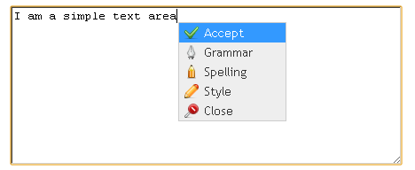

Installation
============

Installing the plug-in is relatively straightforward, you just need to include the ACCEPT plug-in CSS and JS files in your Web application.

There are several ways to use the plug-in and depending on the approach you take you may need to include a few more files and make some configuration changes.

This version of the plug-in can be used in the following ways:

  * Context Menu: Adding right click support to a text area to bring up the ACCEPT menu (Grammar, Spelling, Style).
  * TinyMCE Integration: Embedding the check option into the Tiny MCE text editor
  * External Call: Trigger the check option from an external HTML element (pre-existing element or DOM injected in real time) click.

Context Menu
------------

With this approach you will need to pass a DOM element selector (element ID or element CSS class) as a parameter so that a mouse (right) click event can be injected which will triggers a context menu.

Besides a close button, this context menu has four options available:

   * ACCEPT – gets the text from an input area element and performs a style, grammar and spelling checking on it. The results are displayed in a dialog box.
   * Grammar – gets the text from an input area checks the text grammar. The results are displayed in a dialog box.
   * Spelling - gets the text from an input area and search for spelling errors in the text. The results are displayed in a dialog box.
   * Style - gets the text from an input area and evaluates the style of the text. The results are displayed in a dialog box.

If you intend to use the plug-in in a simple input area triggered by the mouse right click you need to include the files in your web page:

.. code-block:: html

    
    
    <link href="../css/Accept.css" rel="stylesheet" type="text/css" />
    <link href="../css/jquery-ui.css" rel="stylesheet" type="text/css" />
    
    

The following is an example of the code needed.

.. code-block:: javascript

    $(document).ready(function () {
        $("#myTextArea").Accept({
			configurationType: 'contextMenu',
			righClickEnable:true,
            AcceptServerPath: "http://www.accept-portal.eu/AcceptApi/Api/v1",
            ApiKey:"ENTER_KEY_HERE",
            Lang: "en",
            imagesPath: "../css/images",
			requestFormat: "HTML",
			styleSheetPath: '../css/'
        });
    });

TinyMCE Integration
-------------------

With this approach we can embed a right click context menu into the Tiny MCE editor or trigger the check from a button situated in the editor toolbar:

In this case the same options explained above are available and there is an additional button called “ACCEPT” on the TinyMCE toolbar that can be used the same way as the “ACCEPT” option within the context menu.

The following screenshot shows how this will look:

    .. image:: ../../_static/tinyMCEContextMenu.png
        :align: center

The following is an example of the code needed.

.. code-block:: javascript

    $(document).ready(function () {
        $("#myTextArea").Accept({
            configurationType: 'tinyMceEmbedded',
            AcceptServerPath: "http://www.accept-portal.eu/AcceptApi/Api/v1",
            ApiKey:"ENTER_KEY_HERE",
            Lang: "en",
            imagesPath: "../css/images",
            tinyMceUrl: "../extras/tiny_mce/tiny_mce.js",
			styleSheetPath: '../css/',
			requestFormat: "HTML"
        });
    });

.. _externalCall:

External Call
-------------

This approach allows to trigger the content check from a click event bound to any HTML element in the DOM. This HTML element can be part of the existing page or can be added in real time as part of the plug-in configuration process.

The following screenshot shows how this will look:

    .. image:: ../../_static/externalCall_installationSection_1.png
        :align: center

The following is an example of the code needed.

.. code-block:: javascript

    $(document).ready(function () {
        $("#myTextArea").Accept({
        configurationType: 'externalCall',
        AcceptServerPath: "http://www.accept-portal.eu/AcceptApi/Api/v1",
        ApiKey: "ENTER_KEY_HERE",
        Lang: "en",
        imagesPath: "images",
		injectSelector: "#elementIdFromWhereTheHtmlContentWillBeInjected",
        triggerCheckSelector: "#elementIdFromWhereTheContentCheckCanBeTriggered",
        injectContent: '',
        injectWaitingPeriod: 100
        });
    });

